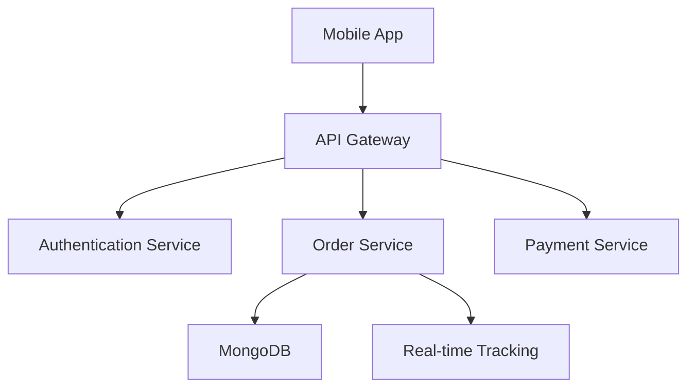

# Farcon - From Farm to Your Door 🌾

[](https://flutter.dev/)
[](https://nodejs.org/)
[](https://www.mongodb.com/)
[](https://expressjs.com/)

A revolutionary platform connecting farmers directly with consumers, eliminating middlemen and delivering farm-fresh produce at 15% below market prices while reducing delivery times by up to 80%.

## 📱 Features

### For Consumers
- **Browse Local Farmers**: View farmers delivering to your area
- **Real-Time Order Tracking**: Track your deliveries live on map
- **Secure Payments**: Integrated payment gateway
- **Farmer Selection**: Choose your preferred local farmer
- **Order History**: Track past orders and reorder easily

### For Farmers
- **Order Management**: Track and manage incoming orders
- **Inventory Control**: Update product availability
- **Route Optimization**: Efficient delivery planning
- **Sales Analytics**: Track performance and trends
- **Direct Customer Communication**: In-app messaging system

## 🛠️ Tech Stack

- **Frontend**: Flutter
- **Backend**: Node.js, Express.js
- **Database**: MongoDB
- **Design**: Figma
- **Cloud Services**: AWS/Google Cloud
- **Maps**: Google Maps API
- **Payments**: Stripe/Razorpay

## 📊 System Architecture



## 🚀 Getting Started

### Prerequisites

- Node.js (v14 or higher)
- Flutter SDK
- MongoDB
- Git

### Installation

1. Clone the repository
```bash
git clone https://github.com/shivprasadrahulwad/farcon.git
cd farcon
```

2. Backend Setup
```bash
cd backend
npm install
cp .env.example .env
# Update .env with your credentials
npm run dev
```

3. Frontend Setup
```bash
cd ../frontend
flutter pub get
# Update lib/config/config.dart with your API endpoints
flutter run
```

## 📁 Project Structure

```
farcon/
├── backend/
│   ├── controllers/
│   ├── models/
│   ├── routes/
│   ├── middleware/
│   └── services/
├── frontend/
│   ├── lib/
│   │   ├── models/
│   │   ├── views/
│   │   ├── controllers/
│   │   ├── services/
│   │   └── widgets/
│   ├── assets/
│   └── test/
└── docs/
```

## 🔧 Environment Variables

### Backend
```env
MONGODB_URI=your_mongodb_uri
PORT=5000
JWT_SECRET=your_jwt_secret
CLOUD_NAME=your_cloud_name
API_KEY=your_api_key
API_SECRET=your_api_secret
```

### Frontend
```dart
// lib/config/config.dart
const String API_BASE_URL = 'http://your-api-url';
const String GOOGLE_MAPS_API_KEY = 'your_google_maps_key';
```

## 📱 Screenshots

<table>
  <tr>
    <td>Home Screen</td>
    <td>Farmer List</td>
    <td>Order Tracking</td>
  </tr>
  <tr>
    <td></td>
    <td></td>
    <td></td>
  </tr>
</table>

## 🧪 Running Tests

### Backend Tests
```bash
cd backend
npm test
```

### Frontend Tests
```bash
cd frontend
flutter test
```

## 🚀 Deployment

### Backend Deployment
```bash
cd backend
npm run build
npm start
```

### Frontend Deployment
```bash
cd frontend
flutter build apk  # for Android
flutter build ios  # for iOS
```

## 🤝 Contributing

1. Fork the Project
2. Create your Feature Branch (`git checkout -b feature/AmazingFeature`)
3. Commit your Changes (`git commit -m 'Add some AmazingFeature'`)
4. Push to the Branch (`git push origin feature/AmazingFeature`)
5. Open a Pull Request

## 📈 Performance Metrics

- 15% Lower prices than market rates
- 80% Reduction in delivery times
- User satisfaction rate: 4.8/5

## 🔜 Roadmap

- [ ] Implement AI-based demand prediction
- [ ] Add subscription service for regular deliveries
- [ ] Integrate weather alerts for farmers
- [ ] Expand to more cities
- [ ] Add organic certification tracking

## 📄 License

This project is licensed under the MIT License - see the [LICENSE.md](LICENSE.md) file for details.

## 📞 Contact

- Email: your.email@example.com
- Project Link: [https://github.com/shivprasadrahulwad/farcon](https://github.com/shivprasadrahulwad/farcon)

---

<div align="center">
Made with ❤️ by Shivprasad Rahulwad
</div>
